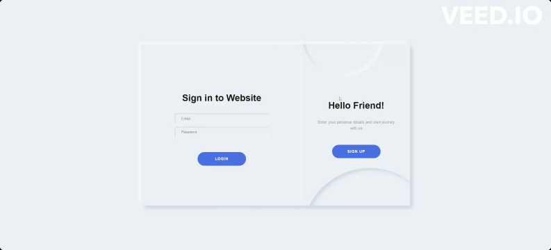

<h1>Страница авторизации/регистрации через Firebase</h1>

## Технологии


<div align="center">
  
</div>


## Запуск проекта:
* Склонировать проект на ваш компьютер с Github с помощью команды:
```
git clone https://github.com/AgentC84/login-page.git
```

* Установить зависимости с помощью команды:
```
npm install
```
* Создать файл для подключения к Firebase:
  - в корневой папке создать файл .env.local со структурой 
  ```
  REACT_APP_FIREBASE_API_KEY = ...
  REACT_APP_FIREBASE_AUTH_DOMAIN = ...
  REACT_APP_FIREBASE_PROJECT_ID = ...
  REACT_APP_FIREBASE_STORAGE_BUCKET = ...
  REACT_APP_FIREBASE_MESSAGING_SENDER_ID = ...
  REACT_APP_FIREBASE_APP_ID = ...
  REACT_APP_FIREBASE_MEASUREMENT_ID = ...
  ```
  - Зайти на официальный сайт Google Firebase и создать новый проект.
  - В настройках проекта скопировать данные для инициализации Firebase и подставить в соответствующие переменные в .env.local
  
* Запустить проект с помощью команды:
```
npm start
```
